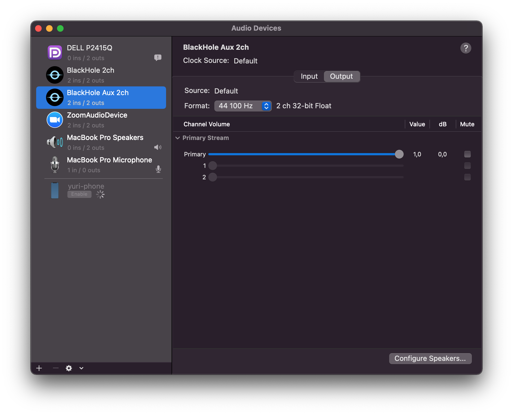

# BlackHole with "Aux": 2 Virtual Audio Drivers

This is a fork from [ExistentialAudio/BlackHole](https://github.com/ExistentialAudio/BlackHole), which is a modern MacOS virtual audio driver that allows applications to pass audio to other applications with zero additional latency.

The main difference of it is **to provide an extra auxiliar audio interface (BlackHole Aux 2ch)**, which is useful to do some more advanced routing, like you can see in [this use-case, where one interface is used to capture the audio, and the other will output it](https://github.com/ExistentialAudio/BlackHole/discussions/64#discussioncomment-168447) (which was not supported by the original BlackHole project).

# Installing 

1. Download the zip files `BlackHole.driver.zip` and `BlackHoleAux.driver.zip` from the latest release
2. Unzip them and copy the folders `BlackHole.driver` and `BlackHoleAux.driver` to `/Library/Audio/Plug-Ins/HAL/` (your password may be required)
3. Open the `Terminal` app and run `sudo launchctl kickstart -kp system/com.apple.audio.coreaudiod`

You should now see `BlackHole 2ch` & `BlackHole Aux 2ch` listed if you open `Audio MIDI Setup` app.

To uninstall, delete the folders you copied inside `/Library/Audio/Plug-Ins/HAL/`, run `sudo launchctl kickstart -kp system/com.apple.audio.coreaudiod` and you shouldn't see them listed anymore.

For details instructions on how to use it, [go check the docs in the original project](https://github.com/ExistentialAudio/BlackHole).

# Coming Soon

- [ ] Install method using `brew`
- [ ] Automated builds
